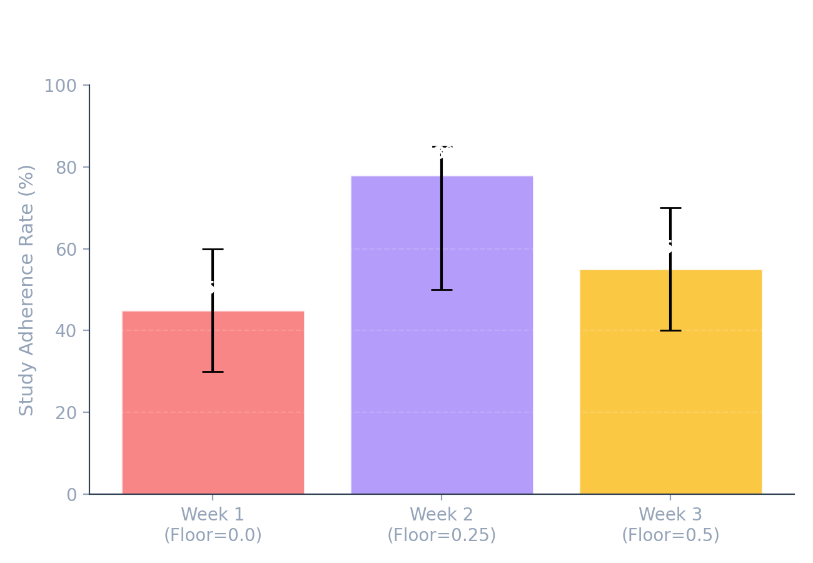
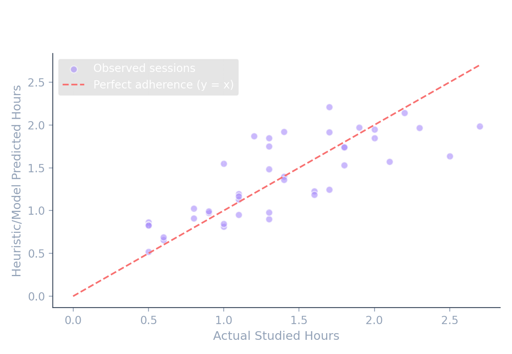

# Study Schedule Generator

i built this because sem 6 at karnavati university was kicking my ass. i had 6 courses, zero time management, and was wasting 4 hours studying easy stuff (like blockchain) while spending only 1 hour on hard stuff (like probability). this app is a simple tool to generate study schedules, track sessions, and run basic exploratory stats on study habits.

---

## how it actually works

### 1. the scheduling algorithm (rule-based math)
this is NOT machine learning. calling it "ai-powered" is a stretch that will get you laughed out of a technical interview. it is just a deterministic math formula that calculates study hours for a subject on any given day:

`allocated_hours = credits * 1.5 * grade_factor * difficulty_factor * urgency_factor * historical_avg`

here is what goes into it:
- **credits**: baseline is 1.5 hours per credit.
- **grade_factor**: scales based on how bad you did in the past. if you got a 90, you need less prep. if you got a 60, you need more: `max(0.5, (100 - past_grade) / 50)`.
- **difficulty_factor**: how hard you rated the course (1 to 5), normalized: `difficulty / 3`.
- **urgency_factor**: gets bigger as exams get closer. capped at 2.0x, floored at 0.25x: `max(0.25, min(2.0, 14 / days_until_deadline))`.
- **historical_avg**: an adjustment multiplier updated by the feedback loop.

### 2. the feedback loop (exponential smoothing)
when you log a study block, the backend updates your `historical_avg` for that subject. this is NOT "online learning"—there's no gradient descent here. it is just standard exponential smoothing with a decay factor (alpha) of 0.3:

`new_historical_avg = (historical_avg * 0.7) + (recent_ratio * 0.3)`

where the recent ratio is `actual_hours / planned_hours`. this helps the scheduler allocate more time for subjects you consistently take longer to study, and less for subjects you breeze through.

---

## the manual parameter sweep (floor tuning)

to find the best urgency floor value, i did a manual parameter sweep over three weeks (no, it was not an A/B test because n=1 and there was no control group):

- **week 1 (urgency floor = 0.0)**: adherence range 30-60%, mean 45%. without a floor, the scheduler allocated 0 hours when exams were far away, leading to extreme cramming.
- **week 2 (urgency floor = 0.25)**: adherence range 50-85%, mean 78%. this kept daily allocations consistent and manageable.
- **week 3 (urgency floor = 0.5)**: adherence range 40-70%, mean 55%. the floor was too high, making daily study targets exhausting and hard to finish.

so i stuck with 0.25. note that since this is n=1 self-tracked data, it is exploratory and noisy as hell.



---

## exploratory machine learning analysis

to see if i could predict my own study adherence, i threw scikit-learn's linear regression at 3 weeks of my self-tracked log data (n=42 sessions). 

### features i looked at:
- `sleep_hours` (how much sleep i got the night before)
- `difficulty` (1-5 course difficulty rating)
- `planned_hours` (how many hours the scheduler allocated)
- `is_weekend` (1 if saturday/sunday, 0 if weekday)

### target variable:
- `adherence`: `actual_hours / planned_hours` (capped at 1.5 to clean up weird outliers)

### the model parameters:
- **sample size (n)**: 42
- **r2 score**: 0.1283
- **intercept**: 0.4519
- **coefficients**:
  - `sleep_hours`: **+0.0259** (sleeping more correlates with higher adherence)
  - `difficulty`: **-0.0288** (harder subjects correlate with lower adherence)
  - `planned_hours`: **+0.0210**
  - `is_weekend`: **-0.0158** (weekends reduce study adherence slightly)

### interview discussion points:
- **underfitting**: the r2 is terrible (~0.12), meaning these features only explain 12% of the variance. human focus is noisy and depends on mood, caffeine, and other stuff we don't track. this is a great point to bring up in interviews to show you actually understand model evaluation.
- **exploratory value**: the signs of the coefficients are intuitive. sleep helps focus, while subject difficulty makes you want to quit early.
- **small dataset**: 42 rows is tiny. to build a real predictive model, you'd need at least 100+ days of logs.



---

## design decisions: why a heuristic over a deep model?

if an interviewer asks why i didn't use a deep learning model to build the actual scheduler:
1. **cold start problem**: a new user has zero study logs. a neural network would crash or behave randomly without training data. the heuristic works immediately.
2. **explainability**: i can explain exactly why the scheduler recommends 2 hours for math today. with deep learning, it's a black box.
3. **overhead**: running heavy models on a local machine or cheap host is overkill when basic arithmetic solves the problem.

---

## tech stack
- **backend**: FastAPI, SQLAlchemy, SQLite, Scikit-learn, Pandas, Matplotlib
- **frontend**: Vanilla HTML, CSS Grid/Flexbox, Chart.js (wanted to show i don't need frameworks to build a clean ui).

---

## setup and run

1. install what you need:
   ```bash
   pip install -r requirements.txt
   ```
2. recreate database and generate plots:
   ```bash
   python seed.py
   python backend/app/ml_analysis.py
   ```
3. start the backend server:
   ```bash
   cd backend
   uvicorn main:app --reload
   ```
4. start the frontend server:
   ```bash
   cd frontend
   python -m http.server 8080
   ```
5. open `http://localhost:8080` in your browser.
